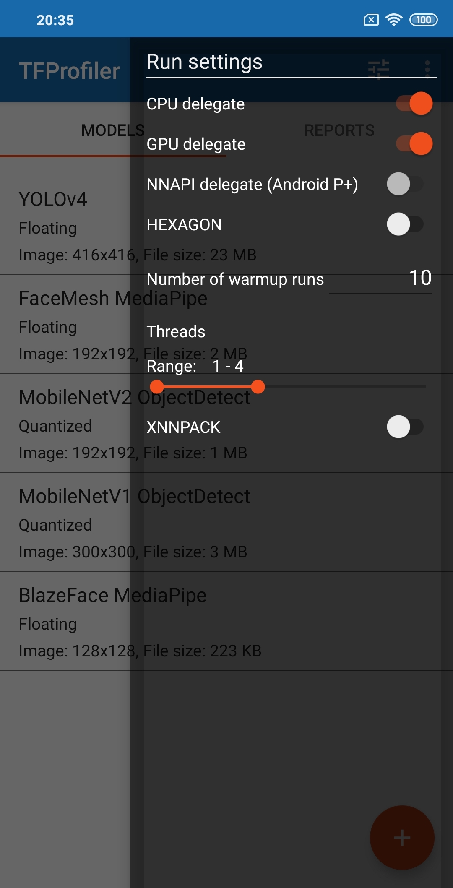
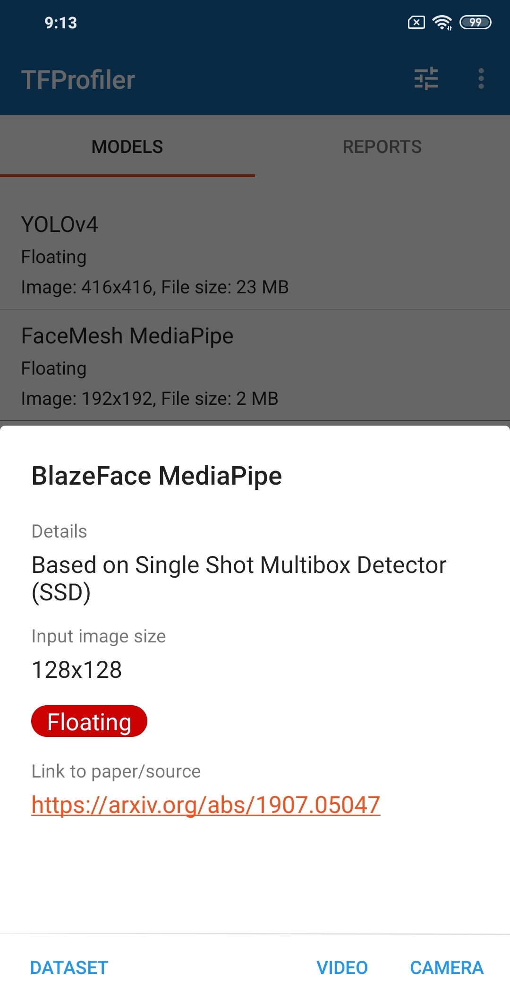
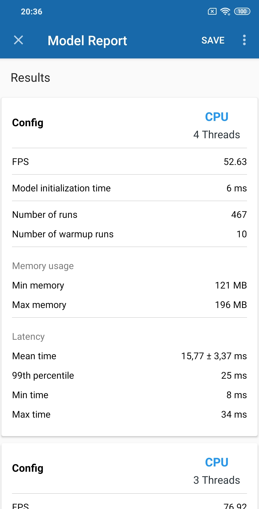

# TFProfiler – ready to use 🚀 

[![Build Status][build-status-svg]][build-status-link]

# Overview

TFProfiler is an app that aims to profile your [TensorFlow Lite](https://www.tensorflow.org/lite) model. 

Measure model performance with FPS, model initialization time,  inference time, memory consumption, etc. 

Tweak model runs with different delegates (CPU, GPU, NNAPI, HEXAGON), XNNPACK option, and number of threads. 

Apply a batch processing, adjusting the number of input images. TFLite batch inference is [partially supported](https://github.com/tensorflow/tensorflow/issues/37706) by TensorFlow.

Run various (*.caffemodel, *.onnx, *.pb, etc) neural models supported by [OpenCV DNN module](https://docs.opencv.org/4.5.2/d6/d0f/group__dnn.html). OpenCV **4.5.2** is integrated inside the app.

- **Android API SDK 21+**
- **Written in [Kotlin](https://kotlinlang.org)**
- **TFLite 2.5.0 inside**

# Features

The app displays a list of models built inside the app that can be used to measure its performance on device. Also, you can upload your *.tflite model and see how it works on the smartphone.

   &nbsp;&nbsp;&nbsp;
    &nbsp;&nbsp;&nbsp;
   

 

## Download

Latest `apk` release can be found on release [page](https://github.com/iglaweb/TFProfiler/releases).

Or download app via Google Play:

## Built-in models

App has built-in models that you can play with to see how inference performance is analyzed.

* [MobileNetV1][tf-models]
* [MobileNetV2][tf-models]
* [YOLOV4][yolov4]
* [Blazeface][blazeface]
* [Facemesh][facemesh]

[tf-models]: https://www.tensorflow.org/lite/guide/hosted_models
[yolov4]: https://github.com/hunglc007/tensorflow-yolov4-tflite
[facemesh]: https://google.github.io/mediapipe/solutions/face_mesh.html
[blazeface]: https://google.github.io/mediapipe/solutions/face_detection.html

## Image Dataset
The app has built-in a subset of image dataset [Caltech 101](http://www.vision.caltech.edu/Image_Datasets/Caltech101/). It is used for running model inteferences.

## Libraries
* [TensorFlow Lite][tf-lite]
* [Android Architecture Components][arch]
* [Timber][timber] for logging
* [Room][room] - Access your app's SQLite database with in-app objects and compile-time checks.

[tf-lite]: https://www.tensorflow.org/lite
[arch]: https://developer.android.com/arch
[room]: https://developer.android.com/topic/libraries/architecture/room
[timber]: https://github.com/JakeWharton/timber

# Performance tips

We can boost model performance and energy efficiency using various optimization techniques.

Model optimization aims to create smaller models that are generally faster and more energy efficient, so that they can be deployed on mobile devices. 

1. Check ops compatibility for each delegate, [CPU](https://github.com/tensorflow/tensorflow/blob/master/tensorflow/lite/tools/versioning/runtime_version.cc), [GPU](https://www.tensorflow.org/lite/performance/gpu_advanced#supported_ops), [XNNPACK](https://developer.android.com/ndk/guides/neuralnetworks#operands).
1. Use [XNNPACK](https://blog.tensorflow.org/2020/07/accelerating-tensorflow-lite-xnnpack-integration.html) to boost float-point inference.

2. Use [GPU](https://www.tensorflow.org/lite/performance/gpu) delegate to compare with CPU and other options. If some of the ops are not supported by the GPU delegate, the TF Lite will only run a part of the graph on the GPU and the remaining part on the CPU.

3. Experiment with [NNAPI](https://www.tensorflow.org/lite/performance/nnapi) (Android API 27+) delegate to see whether the models works faster on Android.

4. Try to use [quantization](https://www.tensorflow.org/lite/performance/model_optimization#quantization) to optimize model.

5. Accelerate TFLite model on Qualcomm [Hexagon DSPs](https://blog.tensorflow.org/2019/12/accelerating-tensorflow-lite-on-qualcomm.html)

6. Experiment with version of TensorFlow Lite library

7. Deploy different models for different devices

# Credits
Launcher icon was built using [this one](https://www.flaticon.com/free-icon/neural_2103620). Icons made by [Becris](https://www.flaticon.com/authors/becris) from [https://www.flaticon.com/](www.flaticon.com)

# Issues

If you find any problems or would like to suggest a feature, please
feel free to file an [issue](https://github.com/iglaweb/TFProfiler/issues)

## License

    Copyright 2020 Igor Lashkov

    Licensed under the Apache License, Version 2.0 (the "License");
    you may not use this file except in compliance with the License.
    You may obtain a copy of the License at

       http://www.apache.org/licenses/LICENSE-2.0

    Unless required by applicable law or agreed to in writing, software
    distributed under the License is distributed on an "AS IS" BASIS,
    WITHOUT WARRANTIES OR CONDITIONS OF ANY KIND, either express or implied.
    See the License for the specific language governing permissions and
    limitations under the License.

 [build-status-svg]: https://travis-ci.org/iglaweb/TFProfiler.svg?branch=master
 [build-status-link]: https://travis-ci.org/github/iglaweb/TFProfiler
 [license-svg]: https://img.shields.io/badge/license-APACHE-lightgrey.svg
 [license-link]: https://github.com/iglaweb/TFProfiler/blob/master/LICENSE